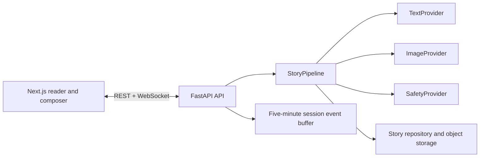

# Architecture

## Runtime Shape

The local default uses deterministic mock providers and JSON/object-file storage. Production boundaries are kept explicit: provider interfaces, repository, media storage and session store can be exchanged independently.

## Data Model

`PromptInput` captures free-text, chips, or guided inputs with vibe, age, language and illustration format. `StoryPlan` validates exactly four arc stages and owns its `WorldBible`, character token sheets and scene outlines. `StoryRecord` persists plan, prose, media URLs, timing, model versions and estimated cost.

## Agent Graph

1. Screen the incoming idea under age-band safety rules.
2. Ask the text provider for a schema-validated world, character set and four-scene outline.
3. Produce one reference sheet per character before any page illustration.
4. Stream safe prose paragraphs per scene.
5. Assemble a style-locked, token-locked image prompt; pass a stable seed and available reference.
6. Persist the completed story and emit a completion event.

## Streaming Protocol

The client connects to `/ws/{session_id}` after creating a record with `POST /api/v1/stories`. Messages are JSON objects containing `type`, `session_id`, `data`, and `emitted_at`.

| Type | Payload purpose |
| --- | --- |
| `plan_ready` | World, characters and outline for immediate scaffolding |
| `character_sheet` | Reference-sheet URL for a stable hero preview |
| `scene_text` | One paragraph for one scene |
| `scene_image` | Signed/local URL of the rendered illustration |
| `scene_complete` | Marks a scene ready |
| `story_complete` | Full persisted story |
| `error` | Friendly refusal or generation interruption |
| `ping` | Connection liveness response |

The in-memory event store retains the last five minutes for reconnect replay. A production deployment should back this contract with Redis.

## Resilience And Controls

`TokenBucket`, `CircuitBreaker` and jittered retry utilities are available for provider adapters. Generation has a configured image cap and degrades by returning text-only scenes after that cap. Safety refusals are typed domain outcomes with suggested rewrites.

## Persistence Roadmap

The app currently ships runnable local JSON and filesystem implementations. Replace these implementations with SQLAlchemy/Alembic against Cloud SQL, Redis session/pub-sub and GCS-signed URL objects for production; their existing interfaces avoid changes to API or frontend consumers.
